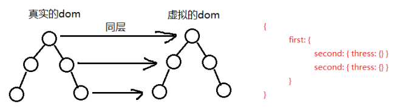
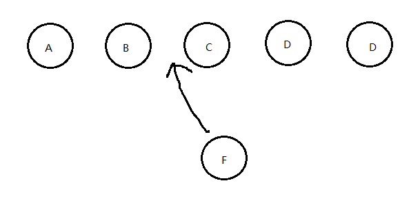
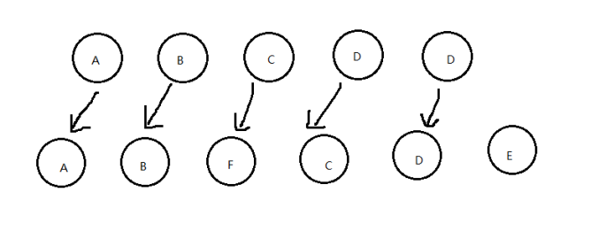

# 快速、简洁讲明Vue中v-for循环key的作用

## 概要

关于`v-for`中的`key`问题，其实这已经是个很常见的问题了，基本网上一搜一大把，面试的时候也常常会被问到，讲这个问题可能会设计`DOM`与虚拟`DOM`，还有很重要的`Diff`算法。传送门

## 作用(重头戏)

我们都知道，`Vue`很大的一个特点就是双向数据绑定，数据一旦改变，那么页面就渲染新的数据呈现在页面上。

那么问题来了，对于用`v-for`渲染的列表数据来说，数据量可能一般很庞大，而且我们经常还要对这个数据进行一些增删改操作。

假设我们给列表增加一条数据，整个列表都要重新渲染一遍，那不就很费事了。

而key的出现就是尽可能的回避这个问题，提高效率，如果我们给列表增加了一条数据，页面只渲染了这数据，那不就很完美了。

`v-for`默认使用就地复用策略，列表数据修改的时候，他会根据`key`值去判断某个值是否修改，如果修改，则重新渲染这一项，否则复用之前的元素。

我们经常使用会使用`index`(即数组的下标)作为`key`，但其实不推荐怎么使用。

## 例如：
```javascript
list = [
    {
        id: 1,
        num: 1
    },
    {
        id: 2,
        num: 2
    },
    {
        id: 3,
        num: 3
    },
];
```
```javascript
<div v-for="(item, index) in list" :key="index">
{{item.num}}
</div>
``` 

上面这种情况我们使用了`index`作为了`key`。

1.在数组后面追加一条数据

```javascript 
list = [
    {
        id: 1,
        num: '1'
    },
    {
        id: 2,
        num: 2
    },
    {
        id: 3,
        num: 3
    },
    {
        id: 4,
        num: '新增加的数据4'
    }
];
``` 

此时前三条数据页面不会重新渲染，直接复用之前的，只会新渲染最后一条数据，此时用`index`作为`key`，没有任何问题。

2.在数组中间插入一条数据

```javascript
list = [
    {
        id: 3, 
        num: 1
    },
    {
        id: 4, 
        num: '新增加的数据4'
    },
    {
        id: 2, 
        num: '2'
    },
    {
        id: 3, 
        num: '3'
    }
];
``` 

页面在去渲染数据的时候，通过`index`定义的`key`的比较，会有：

```javascript
之前的数据                    之后的数据

key: 0  index: 0 num: 1     key: 0  index: 0 num: 1
key: 1  index: 1 num: 2     key: 1  index: 1 num: '新增加的数据4'
key: 2  index: 2 num: 3     key: 2  index: 2 num: 2
                            key: 3  index: 3 num: 3
``` 

通过上面清晰的对比，发现除了第一个数据可以复用之前的之外，另外三条数据都需要重新渲染。

是不是很惊奇，我明明只是插入了一条数据，怎么三条数据都要重新渲染？而我想要的只是新增的那一条数据新渲染出来就行了。

最好的办法是使用数组中不会变化的那一项作为`key`值，对应到项目中，即每条数据都有一个唯一的`id`，来标识这条数据的唯一性。

使用`id`作为`key`值，我们再来对比一下向中间插入一条数据，此时会怎么去渲染呢？例如：

```javascript
list = [
    {
        id: 1,
        num: 1
    },
    {
        id: 4,
        num: '新增加的数据4'
    },
    {
        id: 2,
        num: 2
    },
    {
        id: 3,
        num: 3
    }
];
``` 
```javascript
之前的数据                               之后的数据

key: 1  id: 1  index: 0 num: 1     key: 1  id: 1  index: 0 num: 1
key: 2  id: 2  index: 1 num: 2     key: 4  id: 4  index: 1 num: '新增加的数据4'
key: 3  id: 3  index: 2 num: 3     key: 2  id: 2  index: 2 num: 2
                                   key: 3  id: 3  index: 3 num: 3
``` 

现在对比发现只有一条数据变化了，就是`id`为4的那条数据，因此只要新渲染这一条数据就可以了，其他都是就复用之前的。

同理在`react`中使用`map`渲染列表时，也是必须加`key`，且推荐做法也是使用`id`，也是这个原因。

其实，真正的原因并不是`vue`和`react`怎么怎么，而是因为`Virtual DOM` 使用`Diff`算法实现的原因。

## 关于Diff简析

1.  当页面的数据发生变化时，Diff算法只会比较同一层级的节点。

2.  如果节点类型不同，直接干掉前面的节点，再创建并插入新的节点，不会再比较这个节点的子节点了。

3.  如果节点类型相同，则会重新设置该节点的属性，从而实现节点的更新。


## 举个例子

我们往一个列表里面插入一条数据：



Diff算法默认执行的是这样子：



这样子的话效率就很慢了，这时需要使用key来给每个节点做一个唯一标识，`Diff`算法就可以正确的识别此节点，找到正确的位置区插入新的节点。