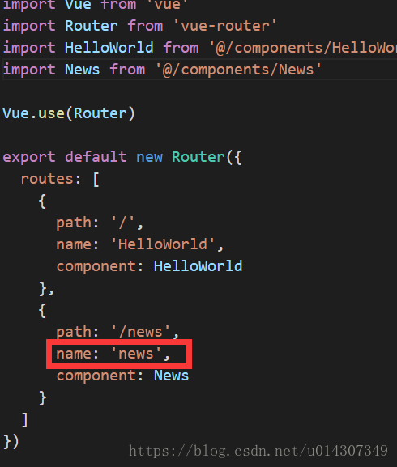
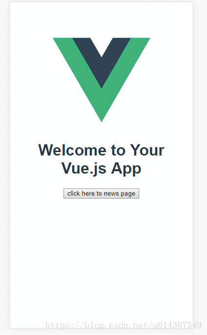
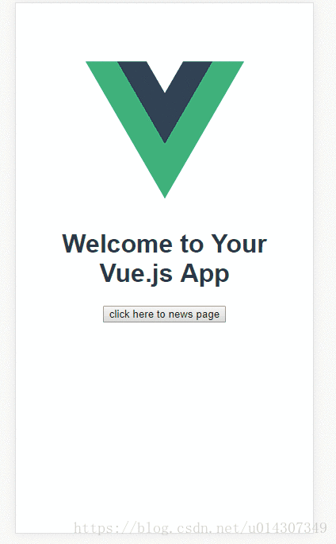
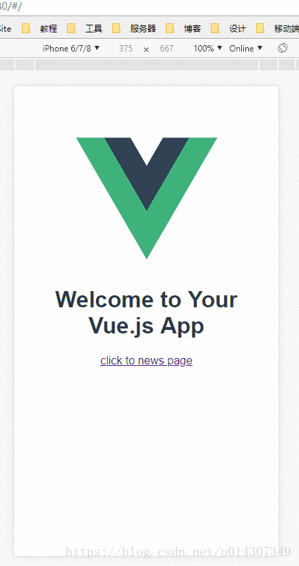
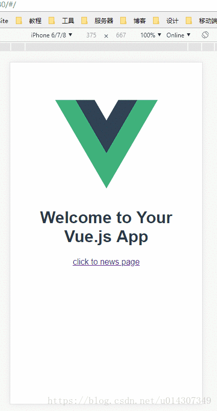

# vue-router几种传参方式及区别

vue-router传递参数分为两大类

*   编程式的导航 router.push
*   声明式的导航

# <a name="t0"></a><a name="t0"></a>编程式的导航 router.push

编程式导航传递参数有两种类型：字符串、对象。

## <a name="t1"></a><a name="t1"></a>字符串

字符串的方式是直接将路由地址以字符串的方式来跳转，这种方式很简单但是不能传递参数：

<code class="language-javascript hljs">this.$router.push("home");</code> 
## <a name="t2"></a><a name="t2"></a>对象

想要传递参数主要就是以对象的方式来写，分为两种方式：命名路由、查询参数，下面分别说明两种方式的用法和注意事项。

### <a name="t3"></a><a name="t3"></a>命名路由

命名路由的前提就是在注册路由的地方需要给路由命名如：



命名路由传递参数需要使用params来传递，这里一定要注意使用params不是query。目标 页面接收传递参数时使用params

 特别注意：命名路由这种方式传递的参数，如果在目标页面刷新是会出错的

使用方法如下：

<code class="language-javascript hljs">this.$router.push({ name: 'news', params: { userId: 123 }})</code>

代码如下：

```javascript
<template>

    <div class="hello">

    <h{{ msg }}</h

    <button @click="routerTo">click here to news page</button>

    </div>

  </template>

  <script>

    export default {

        name: 'HelloWorld',

        data () {

            return {

            msg: 'Welcome to Your Vue.js App'

            }

        },

        methods:{

            routerTo(){

            this.$router.push({ name: 'news', params: { userId: }});

            }

        }

    }

    </script>

<style>

</style>
```

接受传递的参数：
```javascript
<template>

<div>

this is the news page.the transform param is {{this.$route.params.userId}}

</div>

</template>

<script>

</script>
```

运行效果如下：



### <a name="t4"></a><a name="t4"></a>查询参数

查询参数其实就是在路由地址后面带上参数和传统的url参数一致的，传递参数使用query而且必须配合path来传递参数而不能用name，目标页面接收传递的参数使用query。
注意：和name配对的是params，和path配对的是query
使用方法如下：

<code class="language-javascript hljs">this.$router.push({ path: '/news', query: { userId: 123 }});</code>

代码如下：

```javascript
  
<template>

<div class="hello">

<h>{{ msg }}</h>

<button @click="routerTo">click here to news page</button>

</div>

</template>

<script>

export default {

name: 'HelloWorld',

data () {

return {

msg: 'Welcome to Your Vue.js App'

}

},

methods:{

routerTo(){

this.$router.push({ path: '/news', query: { userId:  }});

}

}

}

</script>

<style>

</style>
```


接收参数如下：
```javascript
<template>

    <div>

    this is the news page.the transform param is {{this.$route.query.userId}}

    </div>

    </template>

    <script>

</script>
```
运行效果如下：



# <a name="t5"></a><a name="t5"></a>声明式的导航

声明式的导航和编程式的一样，这里就不在过多介绍，给几个例子大家对照编程式理解，例子如下：

##### 字符串
##### 命名路由

运行效果如下：



##### 查询参数

运行效果如下：



最后总结：路由传递参数和传统传递参数是一样的，命名路由类似表单提交而查询就是url传递，在vue项目中基本上掌握了这两种传递参数就能应付大部分应用了，最后总结为以下两点：
* 1.命名路由搭配params，刷新页面参数会丢失
* 2.查询参数搭配query，刷新页面数据不会丢失
* 3.接受参数使用this.$router后面就是搭配路由的名称就能获取到参数的值**